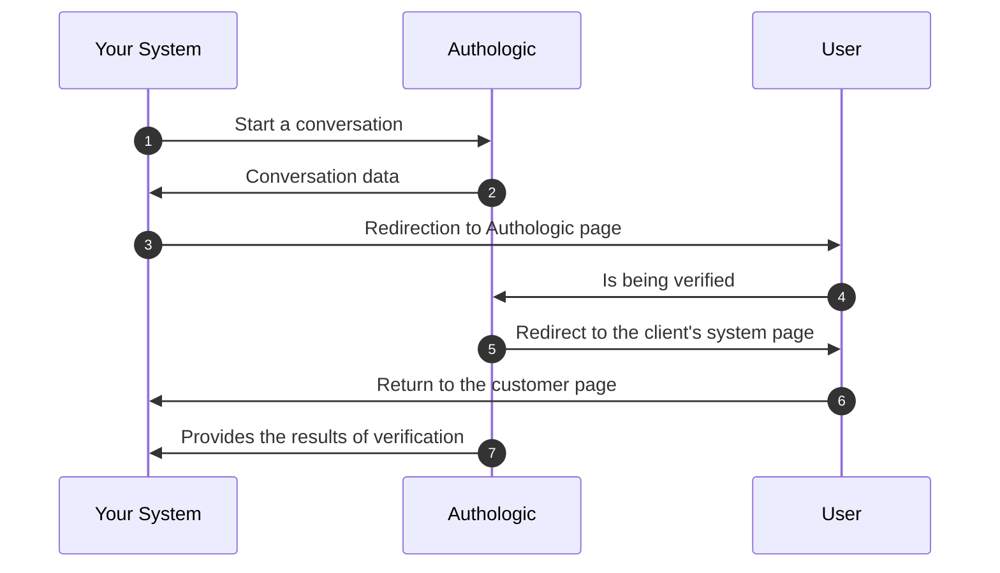
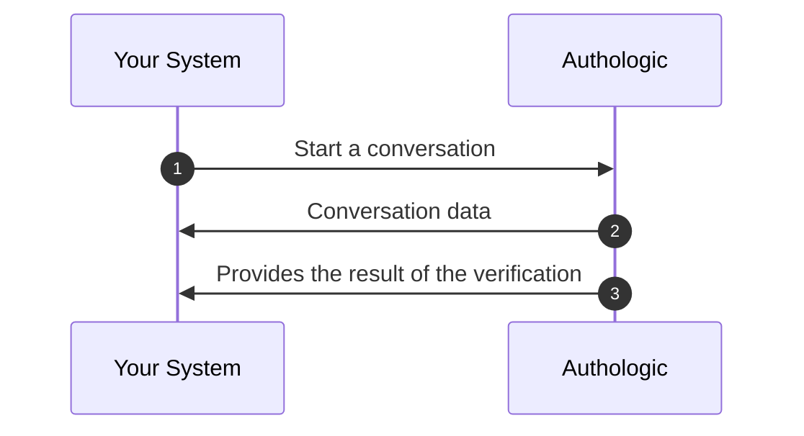

# Overview

<!-- theme: info -->
>
> Authologic allows you to execute a simple and effective verification of the user's identity. 
> The use of the API consists of initiating the process by an external system, redirecting the 
> user to the appropriate page, and then receiving the verification results.

The entire verification process comes down to three steps:
 
- Sending to Authologic notification what data you want to get and what products you will use
- Redirecting the user to a unique address returned by Authologic
- Receiving user information via a callback mechanism.

We have called the entire process 'conversation'. In the picture, the process looks like this:

1. Start of the identity verification process. Your server calls the API method called: *POST /api/conversations*
2. The response returns information about the address to which the user should be redirected
3. Your system redirects the user's browser to the above URL
4. The user verifies himself
5. Authologic redirects the user's browser to a predefined page of your system
6. Your server displays the return page
7. Authologic calls a callback on your server's side with the result of the verification

<!-- theme: tip -->
>
> Sometimes Authologic is able to send the verification information before the user is redirected to the 
> return page. However, many types of verification require additional time. When creating your system, it 
> should be taken into account in the process that the verification result will be available to the user only 
> after some time.

There are also products that do not require user interaction. An example may be checking the user in AML 
databases based on the data provided by you. In this case, there is no need to redirect the user to the 
Authologic website and the process is as follows:

1. Start of the identity verification process. Your server calls the API method called: *POST /api/conversations*
2. The response returns information about conversation identifier and status
3. Authologic calls a callback on your server's side with the result of the verification

<!-- theme: info -->
>
> Despite our sincere intentions, it is difficult to create perfect technical documentation.
> If you have an idea on how to improve this documentation, or you have trouble understanding any section,
> please email us at tech-support@authologic.com
