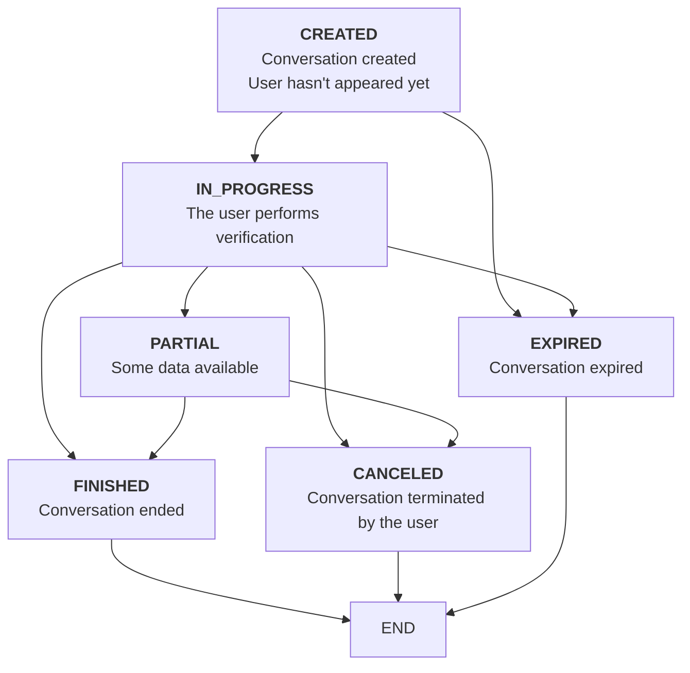
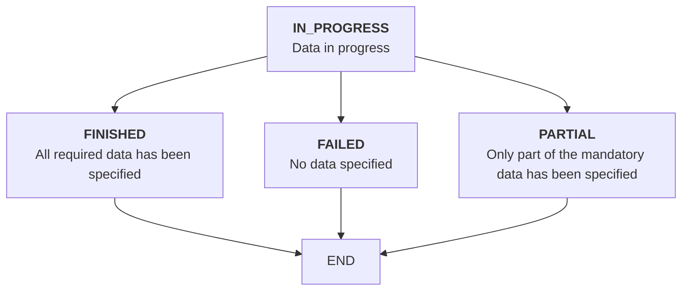

# Conversation Statuses

Take a look at the example conversation below.

```json
{
    "id":"c12c1adc-3ff0-4d32-b95c-c593135c903e",
    "userKey":"7dfb9ded-c38f-49ae-95e2-307283a0b1f6",
    "url":"https://sandbox.authologic.com/c/c12c1adc-3ff0-4d32-b95c-c593135c903e",
    "status":"FINISHED",
    "result":{
        "identity":{
            "status":"FINISHED",
            "user":{
                "person":{
                    "name":{
                        "firstName":"Jan",
                        "lastName":"Testowy"
                    }
                }
            }
        }
    }
}
```

You may notice that there are two different statuses in the response: the `status` field and 
the `result.identity.status` field. We'll describe how they differ below.

## The Status Field

The `status` field specifies at *what point in the life cycle* the conversation is. It may be just started, 
it may just verify the user or quit running. So it can take the following values:

| Status | Meaning | Notes                                                                                                                                                                                                                                                          |
| ------- | ------- |----------------------------------------------------------------------------------------------------------------------------------------------------------------------------------------------------------------------------------------------------------------|
| CREATED | Conversation created. | The conversation has been set up, but the user has not yet been redirected to the process.                                                                                                                                                                     |
| IN_PROGRESS | The user is being verified. | The user has started the process but has not finished it yet.                                                                                                                                                                                                  |
| PARTIAL | Some data has already been determined. | The verification process is ongoing, but some data has already been specified. You can safely treat this status as `IN_PROGRESS`, unless you want to process your data as quickly as possible for example when you use the collection of user transactions.    |
| FINISHED | Conversation finished. | *Regardless of the result* of the conversation, the process is complete, and you can analyze the data returned. Whether the conversation was successful or failed is determined by the status of the product (see below)                                       |
| CANCELED | Conversation aborted. | The user has interrupted the conversation. Concerns the interruption of the process by the user on Authologic websites. Closing the browser or resigning already on the verification method page, it may not involve changing the conversation to this status. |
| EXPIRED | Conversation expired. | Conversation was not finished and now is expired due to the customer's retention policy. |


The transitions between the statuses are shown in the figure below:


    

## The Product Status Field

For `result.identity.status`, this field specifies the result of the identity verification. More generally, Authologic provides for more fields determining the status of specific products. The product is the identity verification (`result.identity.status`) but also e.g. getting user transactions (`result.bankTransactions.status`).

The field can take the following values:

| Status | Meaning | Notes |
| ------- | ------- | ------- |
| IN_PROGRESS | While collecting information. | No data has yet been specified. |
| FINISHED | Complete success. | All required data has been collected. For the product `identity`, this specifies that all mandatory user fields provided when creating the conversation (`query.identity.requireOneOf`) were obtained. |
| PARTIAL | Partial success. | Only part of the data was collected. For the product `identity`, this specifies that only part of the user's mandatory fields specified when creating the conversation (`query.identity.requireOneOf`) was retrieved. |
| FAILED | Failure. | No data could be collected. For the product `identity`, this means nothing of the mandatory user fields provided at creation conversation (`query.identity.requireOneOf`) was not specified. |

The transitions between the statuses are shown in the figure below:



## Example

```json
{
    "id":"c12c1adc-3ff0-4d32-b95c-c593135c903e",
    "userKey":"7dfb9ded-c38f-49ae-95e2-307283a0b1f6",
    "url":"https://sandbox.authologic.com/c/c12c1adc-3ff0-4d32-b95c-c593135c903e",
    "status":"FINISHED",
    "result":{
        "identity":{
            "status":"PARTIAL",
            "user":{
                "person":{
                    "name":{
                        "firstName":"Jan",
                        "lastName":"Testowy"
                    }
                }
            }
        },
        "bankTransactions": {
            "status":"FAILED"
        }
    }
}
```

In the example above, `status` is `FINISHED`. This means that the conversation has finished running, 
and you can analyze the data returned by it.

The conversation consists of two products: `identity` (identity verification) and `bankTransactions` (getting user transactions).

For identity verification, `result.identity.status` is `PARTIAL`. This means that
not all mandatory data from the inquiry were obtained. The obtained data is visible in the `user` structure.

In the case of fetching transactions (`result.bankTransactions`) it has the status `FAILED` which means an error
in downloading transactions. The reason for this error may be, for example, the user's refusal to provide data.

For comparison, an example of complete success:

```json
{
    "id":"c12c1adc-3ff0-4d32-b95c-c593135c903e",
    "userKey":"7dfb9ded-c38f-49ae-95e2-307283a0b1f6",
    "url":"https://sandbox.authologic.com/c/c12c1adc-3ff0-4d32-b95c-c593135c903e",
    "status":"FINISHED",
    "result":{
        "identity":{
            "status":"FINISHED",
            "user":{
                "person":{
                    "name":{
                        "firstName":"Jan",
                        "lastName":"Testowy"
                    }
                }
            }
        },
        "bankTransactions": {
            "status":"FINISHED"
        }
    }
}
```

In this example, the conversation has ended: `status` is `FINISHED`.

At the same time, both products `identity` and `bankTransactions` finished with success: they made it
define all mandatory user fields and download his transactions.

<!-- theme: info -->
>
> Despite our sincere intentions, it is difficult to create perfect technical documentation.
> If you have an idea on how to improve this documentation, or you have trouble understanding any section,
> please email us at tech-support@authologic.com
